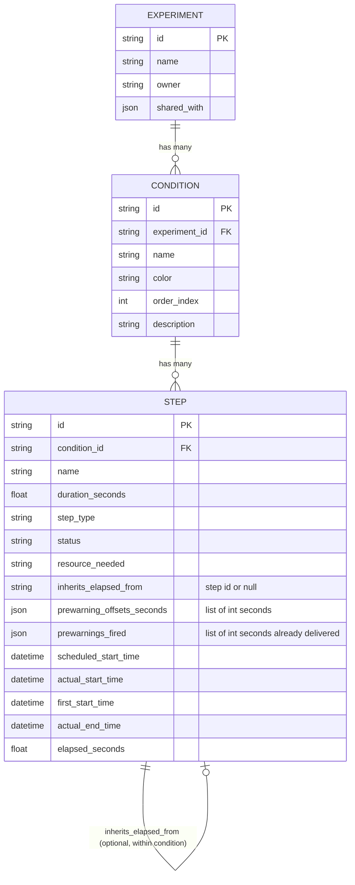
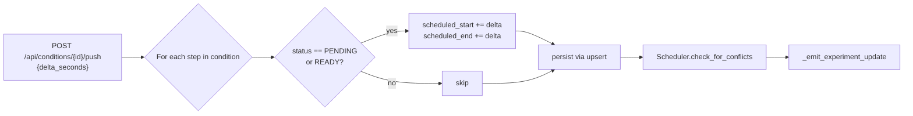
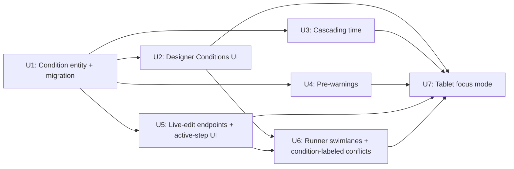

# feat: First-class Conditions + reactive live-edit + tablet focus mode

## Overview

Introduces a first-class **Condition** entity inside Experiments so the lab use case of "multiple parallel protocols in one session" maps cleanly to data instead of being faked with multiple unrelated Experiments. Adds two protocol mechanics the lab workflow demands — **cascading time** between adjacent steps (wash time eats into the next incubation's countdown) and **per-step pre-warnings** (e.g., 10 min before microscope handoff). Ships **two reactive live-edit operations** in the Runner (extend/shrink the active step; push a whole condition by N min) so users can adjust mid-experiment without losing schedule integrity. Ships a **tablet-first focus-mode UI** at `/run/:id?mode=focus` for at-the-bench use: one condition visible at a time, big START/PAUSE/COMPLETE button, swipe to cycle.

Safe-window math (Goal 4 part 2 — "you can delay this until 14:32 without conflict") and the calendar/Gantt visualization (Goal 3) are explicitly the next two plans, not this one. This plan delivers the structural foundation those plans need.

---

## Problem Frame

After the audit-findings fix-pass (PR #1, U1–U8 on `main`), runtimex has a working but flat data model: Experiment → Steps with dependencies. The README's marquee use case — "Dish 1 / Dish 2 / Dish 3 all going through different but overlapping protocols, sharing the microscope" — has no clean expression. Users today create separate Experiments per dish and reason about cross-dish timing in their heads.

The user's brainstorm (origin: `docs/brainstorms/2026-05-06-conditions-and-live-edit-requirements.md`) confirms a concrete shape: protocols composed of conditions; conditions composed of steps; some steps inherit elapsed time from the prior step (the wash → re-incubate biology clock); some steps need pre-warnings; the Runner needs in-place editing for when reality drifts; tablet operators want a single-condition focus mode.

This plan delivers all of that as a cohesive product slice. It builds directly on the already-shipped foundations: U2's SQLAlchemy persistence + upsert-by-step-ID semantics, U6's `Scheduler.check_for_conflicts`, U7's `NotificationService` + factories, U8's snake_case wire format.

---

## Requirements Trace

- **R1** — Conditions as first-class entity with FK on Step; auto-migrated default "Main" condition for existing data (see origin: `docs/brainstorms/2026-05-06-conditions-and-live-edit-requirements.md` R1).
- **R2** — Designer Conditions UI (sidebar create/rename/color/delete/reorder; per-step assignment; condition-aware conflict labels) (R2).
- **R3** — Cascading time via opt-in `inherits_elapsed_from` field on Step; the next step's `elapsed_time` initializes from the referenced step's final elapsed (R3).
- **R4** — Pre-warnings via `prewarning_offsets_seconds` JSON column on Step; client-fire + server-dedupe via `prewarnings_fired` (R4).
- **R5** — Reactive live-edit: `POST /api/steps/<id>/extend` (delta seconds) and `POST /api/conditions/<id>/push` (delta seconds, shifts PENDING/READY only). Conflict detection re-runs; warnings render inline (R5).
- **R6** — Conflict payload includes `condition_a_id`/`name`, `condition_b_id`/`name`; Runner swimlane layout groups steps by Condition (R6).
- **R7** — Tablet focus mode at `/run/:id?mode=focus` (auto-applied for small viewports): one Condition at a time, big buttons, swipe/chevron to cycle, pre-warnings as full-screen interrupts (R7).

**Origin actors:** A1 Experiment Designer (web), A2 Experiment Runner (web), A3 Mobile Operator (tablet/phone).
**Origin flows:** F1 Design multi-condition session, F2 Run a session at the bench, F3 Cascading time across steps, F4 Pre-warning before step end, F5 Live-edit during a run, F6 Mobile focus mode.
**Origin acceptance examples:** AE1 (covers F1, F4, R1, R6), AE2 (F3, R3), AE3 (F4, R4), AE4 (F5, R5), AE5 (F6, R7).

---

## Scope Boundaries

### Deferred for later

(Carried verbatim from origin. Product/version sequencing — these things will be built eventually but not in v1.)

- **Safe-window math (Goal 4 part 2).** `latest_safe_start` / `earliest_safe_start` per upcoming step; impact-preview UI before commit. Explicitly the next plan after this one.
- **Calendar / Gantt visualization (Goal 3).** Becomes mostly trivial once Conditions exist (one swimlane per Condition); planned as the plan after safe-window math.
- **Cross-experiment scheduling.** Conflict detection still operates within a single Experiment in this plan.
- **Shared protocol fragments / step composition.** "Same as Condition 1 from the wash onward" remains copy-paste at design time, not shared step references.
- **Mid-run insert of unplanned steps.** Live-edit operations are bounded to extend/shrink/push.
- **Stagger / start-offset metadata on Conditions.** Conditions stagger naturally via START click timing; no `start_offset` field.
- **PWA install / offline support.** Mobile focus mode is web-only for v1.

### Outside this product's identity

(Carried verbatim from origin. Adjacent products this plan must not accidentally build.)

- **Generic project planner / Gantt tool.** runtimex is a lab-bench timer. Conditions are protocol replicates, not arbitrary task groups.
- **LIMS / inventory / sample tracking.** No reagent inventory, no chain of custody, no sample IDs beyond Condition names.
- **Multi-lab tenancy / org accounts.** Single-user + per-user share is the model.

### Deferred to Follow-Up Work

(Plan-local. Implementation work intentionally split across other PRs.)

- **Background scheduler tick** for auto-completing FIXED_DURATION steps and firing pre-warnings without an open client. Deferred — pre-warnings in this plan use client-fire + server-dedupe (acceptable limitation: at least one user client must have the Runner open).
- **Frontend tooling modernization** (CRA→Vite, MUI 5→6, TS 4.9→5.x). Stays on the existing modernization-deferred follow-up plan.
- **Replace `alert()` / `window.prompt()` with MUI Snackbar/Dialog flows.** UX polish; tracked as deferred.

---

## Context & Research

### Relevant Code and Patterns

- **`backend/models.py`** — ORM models live alongside dataclasses. `ExperimentORM`, `StepORM`, plus `step_dependencies` association table. The dataclass-bridge pattern (`to_dataclass()` / `from_dataclass()` / `apply_dataclass()`) is the convention; new ORM entities follow it.
- **`backend/db.py`** — `init_db(app)` calls `db.create_all()` after registering models. Backfill migrations should run in this same hook, idempotently.
- **`backend/scheduler.py`** — `Scheduler` keeps a hydrated cache of dataclass-shaped Experiments. `_persist_experiment()` is the upsert path. `check_for_conflicts()` is the U6 conflict detector to extend.
- **`backend/notifications.py`** — `NotificationService.add_notification()` persists + broadcasts. Factory helpers in `create_notification_factories()` build typed payloads. `step_timeout_notification` factory is the closest existing analog for pre-warnings; will extend to take an `offset_seconds` argument.
- **`backend/main.py`** — auth + ownership pattern: every route uses `@jwt_required` + `permissions.can_*_experiment`. Step transitions emit `experiment_update` via `_emit_experiment_update`.
- **`backend/serializers.py`** — `experiment_to_dict()` / `step_to_dict()` produce snake_case payloads. New fields (`condition_id`, `inherits_elapsed_from`, `prewarning_offsets_seconds`, `prewarnings_fired`) added here.
- **`frontend/src/pages/ExperimentRunner.tsx`** — ref-based timer pattern (U5), reads `experimentRef` from a `useRef` updated by a side effect. Skip / start / pause / complete go through `apiClient`. New live-edit ops follow the same pattern.
- **`frontend/src/pages/ExperimentDesigner.tsx`** — already uses MUI form components + `Alert` for errors; conditions sidebar should reuse those building blocks.
- **`frontend/src/api/client.ts`** — REST + Conflict interface (added in U6). New endpoints (`extendStep`, `pushCondition`, `getConditions`) follow the same axios pattern; no new socket subscriptions needed.
- **`frontend/src/components/NotificationCenter.tsx`** — already mounted in AppHeader; pre-warning notifications appear there automatically once they're persisted.

### Institutional Learnings

- `docs/solutions/` does not exist yet. The first writeups will likely come out of this plan: (1) the cascading-time mechanic + the test that catches it; (2) the pre-warning client-fire/server-dedupe pattern; (3) the auto-backfill migration approach for FK introduction.

### External References

- Flask-SQLAlchemy 3.x docs (idempotent migration patterns; `db.session.scalar(select(...).where(...))`).
- MUI 5.14 docs for `Drawer`, `SwipeableViews` (or react-swipeable-views — community lib if needed for tablet swipe gestures), `Chip` (for pre-warning offset chips), `ColorLens`-style predefined palettes.

---

## Key Technical Decisions

- **`condition_id` is NOT NULL on `StepORM`** with an auto-backfill migration that creates a default "Main" Condition per existing Experiment in `init_db`. Cleaner model; the backfill is small, idempotent, and safe to re-run.
- **Pre-warnings use a JSON list column** (`prewarning_offsets_seconds: List[int]`) on Step, not a separate table. Cardinality is typically 0–2; a separate table adds joins for no real value.
- **Pre-warning delivery: client-fires + server-dedupes (v1).** The Runner / Mobile per-second tick checks the active step's elapsed time against each `prewarning_offsets_seconds` entry. When a threshold is crossed, the client emits a `prewarning_hit` socket event with `(step_id, offset_seconds)`. The backend fires the notification once (deduped via a `prewarnings_fired: List[int]` JSON column on Step that records which offsets have been delivered). Limitation: pre-warnings only fire when ≥1 user client has the Runner open — accepted for the at-the-bench use case. Background-tick delivery is deferred.
- **Mobile route choice: `/run/:id?mode=focus`** plus auto-application on viewports < 900px wide. Single React component routes between layouts via the `useMediaQuery` hook + the `mode` query param. Cheaper than a separate `/mobile/:id` route; preserves the URL semantics for sharing.
- **"Push condition by N min" semantics: PENDING/READY only.** RUNNING and COMPLETED steps are never moved. Operator-facing label clarifies this ("shifts upcoming steps in this condition").
- **Cross-condition Step dependencies are forbidden in v1.** Backend rejects on save; Designer warns + strips when a step is moved between Conditions.
- **Color palette is predefined (10 colors).** Accessibility-safe, no contrast picker needed. Stored on `ConditionORM.color` as a string from a fixed enum.
- **Live-edit endpoints are dedicated, not generic PUT.** `POST /api/steps/<id>/extend` and `POST /api/conditions/<id>/push` (with `delta_seconds` body field). Dedicated endpoints make the operation explicit, the auth check tight, and the conflict re-detection unambiguous. They reuse the existing serializer + `_emit_experiment_update` pattern.
- **Dataclass mirror for Condition.** A `Condition` dataclass alongside `ConditionORM`, following the existing `Experiment` / `ExperimentORM` bridge pattern. Routes serialize from dataclasses; the cache holds dataclasses; ORM is write-side.

---

## Open Questions

### Resolved During Planning

- **Migration shape:** NOT NULL `condition_id` with auto-backfill of a "Main" Condition per existing Experiment.
- **Pre-warning storage:** JSON list column on Step.
- **Mobile route:** `/run/:id?mode=focus` + viewport auto-detect, no new route.
- **Push-condition semantics:** shifts PENDING/READY in the condition only.
- **Color picker:** predefined 10-color palette.
- **Cross-condition Step move:** Designer warns + strips deps; backend rejects cross-condition deps on save.
- **Pre-warning delivery for v1:** client-fire + server-dedupe; background tick deferred.

### Deferred to Implementation

- **Exact 10-color palette values** — pick at U2 implementation time, defer to MUI's `useTheme` / palette helpers if a clean fit exists.
- **Swipe gesture library choice** — `react-swipeable` vs. native pointer events vs. MUI's experimental `SwipeableDrawer` for a different UX. Decide at U7 implementation.
- **Whether `prewarnings_fired` lives as a JSON column on Step or a denormalized field on a separate `StepEvent` log** — JSON column is the simpler default; reconsider only if a delivery-debugging need emerges.
- **`condition.order_index` reordering UX** — drag-handle vs. up/down chevrons. Implementer choice.

---

## High-Level Technical Design

> *This illustrates the intended approach and is directional guidance for review, not implementation specification. The implementing agent should treat it as context, not code to reproduce.*

### Data model shape



### Pre-warning lifecycle (client-fires + server-dedupes)

```mermaid
sequenceDiagram
    participant Tick as Runner tick (1s)
    participant Client as Runner / Mobile client
    participant Server as Flask + SocketIO
    participant DB as SQLite

    Tick->>Client: now() advances
    Client->>Client: for each prewarning_offset, check<br/>(step.expected_end - now) <= offset<br/>AND offset NOT in prewarnings_fired
    Client->>Server: emit "prewarning_hit"<br/>{step_id, offset_seconds}
    Server->>DB: load Step; verify offset in offsets_seconds<br/>and NOT in prewarnings_fired
    alt fresh fire
      Server->>DB: append offset to prewarnings_fired; commit
      Server->>Server: notification_factories["step_prewarning"](step, experiment, offset)
      Server->>Server: notification_service.add_notification(...)
      Server-->>Client: notification broadcast (user_<owner> room)
    else duplicate (already fired)
      Server-->>Client: silent no-op
    end
```

### Push-condition semantics



---

## Implementation Units

### Unit dependency graph



U1 unblocks everything. U2 / U3 / U4 / U5 can be implemented in any order (or in parallel) once U1 is committed. U6 collects U2 (color palette + Condition labels) and U5 (push-condition API). U7 is the integration point — focus mode renders all the upstream features in a tablet-shaped view.

- U1. **Add Condition entity + auto-backfill migration**

**Goal:** First-class Condition exists in data + dataclass + serializer + cache. Existing experiments transparently gain a "Main" Condition holding their steps.

**Requirements:** R1, R6 (data shape).

**Dependencies:** None.

**Files:**
- Modify: `backend/models.py` — new `Condition` dataclass; new `ConditionORM(db.Model)` with FK on `ExperimentORM`; new `StepORM.condition_id` FK column; `Experiment` dataclass gains `conditions: Dict[str, Condition]`; `to_dataclass`/`from_dataclass`/`apply_dataclass` updated.
- Modify: `backend/db.py` — `init_db` runs an idempotent backfill: for each `ExperimentORM` whose `conditions` is empty, create a `ConditionORM(name="Main", color="default", order_index=0)` and update its existing `StepORM` rows to point to it.
- Modify: `backend/scheduler.py` — `_persist_experiment` writes Conditions; `hydrate_from_db` rebuilds the Conditions cache; `_sync_step_dependencies` rejects cross-condition deps with a `ScheduleConflictError`.
- Modify: `backend/serializers.py` — `experiment_to_dict` includes `conditions: [{id, name, color, order_index, description}]`; `step_to_dict` includes `condition_id`; conflict payload from U6's detector now includes `condition_a_id`/`condition_a_name`/`condition_b_id`/`condition_b_name`.
- Modify: `backend/main.py` — `create_experiment` and `update_experiment` accept `conditions: [...]` in the request body; default-create a "Main" condition if none provided. Reject saves containing cross-condition dependencies (400 with clear error).
- Test: `backend/tests/test_conditions_model.py` — round-trips, backfill, dependency rejection.

**Approach:**
- ORM model mirrors the dataclass exactly; FK has `ondelete="CASCADE"` so dropping an Experiment cascades to Conditions and Steps as today.
- Backfill is wrapped in `with app.app_context():` and uses `db.session.scalars(select(...).where(...))` for idempotency. Only fires for Experiments where `len(conditions) == 0`.
- Cross-condition dep rejection lives at the scheduler layer (`_sync_step_dependencies`) so any code path that persists triggers the same check.

**Patterns to follow:**
- `ExperimentORM` ↔ `Experiment` dataclass bridge. New `ConditionORM` ↔ `Condition` mirrors the same shape (id, name, fields, `to_dataclass`, `from_dataclass`).
- `step_dependencies` association table for many-to-many. Conditions only have one parent (Experiment), so a plain FK suffices.

**Test scenarios:**
- *Happy path:* Create Experiment with two Conditions (A, B), each with three Steps; round-trip via `GET /api/experiments/<id>` returns the same shape.
- *Edge case:* `Covers AE1.` Save AE1's "Cell stress assay" with two Conditions; conflict report includes `condition_a_name` and `condition_b_name` populated when the microscope steps overlap.
- *Edge case (backfill):* Pre-existing Experiment row in DB (simulated via direct ORM insert with no Conditions) gets auto-migrated on next `init_db` to have one "Main" Condition holding its existing Steps. Re-running `init_db` does NOT create duplicate "Main" Conditions.
- *Error path:* POST a Step with a `dependencies: [step_id_in_other_condition]` returns 400.
- *Error path:* PUT moves a Step's `condition_id` to a different Condition while the Step has dependencies on the original Condition's siblings — backend rejects (400) or strips deps (decision: backend rejects; Designer's UI is responsible for stripping before submit, so a stripped-deps PUT succeeds).
- *Integration:* Cascading delete — delete an Experiment, all its Conditions and Steps disappear from the DB.

**Verification:**
- `cd backend && python -m pytest tests/test_conditions_model.py` is green.
- All prior tests (53 from the audit-findings PR) still pass.
- `grep -RnE "Model\.query\.get" backend/` returns no results (we stay on `db.session.get`).

---

- U2. **Designer Conditions UI + condition-aware conflict labels**

**Goal:** Designer lets the user create/rename/color/reorder/delete Conditions and assign each Step to one. Existing experiments still work (default "Main" Condition). Conflict warnings show condition names.

**Requirements:** R1, R2, R6 (UI).

**Dependencies:** U1.

**Files:**
- Modify: `frontend/src/pages/ExperimentDesigner.tsx` — add a Conditions sidebar (or top-tab area) with create/rename/color/reorder/delete; per-step Condition dropdown; condition-strip warning when moving a Step with deps; group the step list by Condition for visual clarity.
- Create: `frontend/src/components/ConditionEditor.tsx` — small drawer or inline panel for editing one Condition (name, color from predefined palette, description).
- Create: `frontend/src/components/ConditionPaletteSwatch.tsx` — the 10-color predefined palette swatch component.
- Modify: `frontend/src/api/client.ts` — interfaces for `Condition`, `Conflict.condition_a_id`/`condition_a_name`/etc; no new endpoints (Conditions ride along with Experiment payloads from U1).
- Modify: `frontend/src/pages/ExperimentRunner.tsx` — conflict alert renders `{step_a_name} (Condition A) ↔ {step_b_name} (Condition B) on {resource} ({overlap_seconds}s overlap)`.
- Test: `backend/tests/test_conditions_routes.py` — request/response shape including conflict labels (kept on the backend side; frontend has no test infrastructure yet).

**Approach:**
- The Designer's existing "list of steps" form is reorganized: Conditions are the outer grouping, Steps live inside. Adding a step prompts for a Condition (defaults to the currently-selected/last-used Condition).
- Color palette is a small fixed enum stored on `ConditionORM.color` (string keys like `slate`, `coral`, `forest`, `lavender`, `amber`, `teal`, `magenta`, `mint`, `navy`, `gold`). Frontend maps keys to MUI palette tokens.
- Reordering uses up/down chevrons in v1 (drag-handle is a polish add; not required).
- Cross-condition Step move: when the user changes a Step's Condition dropdown, if that Step has dependencies, show a confirmation dialog ("Moving this step will remove its X dependencies. Continue?") before the change is staged for save.

**Patterns to follow:**
- `frontend/src/pages/ExperimentDesigner.tsx` existing form structure — keep state local, validate on submit, show MUI `Alert` for errors and warnings.
- `frontend/src/components/AppHeader.tsx` mounts `<NotificationCenter />` inline; the Conditions sidebar is a similar in-page composition.

**Test scenarios:**
- *Happy path:* `Covers AE1.` POST a multi-Condition Experiment; GET returns identical structure including `conditions` array and per-step `condition_id`.
- *Happy path:* PUT renames a Condition; subsequent GET reflects the new name and step membership.
- *Error path:* PUT a step whose `condition_id` doesn't exist on the Experiment returns 400.
- *Edge case:* Change the order_index of two Conditions; GET returns them in the new order.
- *Integration:* Save an Experiment whose conflict pairs span two Conditions; the conflict payload returned in the PUT response includes `condition_a_name` and `condition_b_name`.

**Verification:**
- `pytest backend/tests/test_conditions_routes.py` is green.
- `npx tsc --noEmit` is clean.
- Manual: open the Designer, create 2 Conditions with 3 steps each, save, refresh; everything persists. Move a step between Conditions; the deps-strip warning appears.

---

- U3. **Cascading time across adjacent steps**

**Goal:** A Step opted into `inherits_elapsed_from` initializes its `elapsed_time` from the referenced step's final elapsed when START is clicked. The Runner countdown reflects this immediately.

**Requirements:** R3.

**Dependencies:** U1.

**Files:**
- Modify: `backend/models.py` — `Step` dataclass + `StepORM` get an `inherits_elapsed_from: Optional[str]` field (the source Step's id, or the literal `"previous"` resolved server-side to "the immediately preceding step in this Condition's order"). `Step.start()` consults this field on the first start of a step (status was READY) and seeds `elapsed_time` from the source step.
- Modify: `backend/main.py` — start_step route reads/applies the inherited elapsed before persisting state. `_emit_experiment_update` carries the new shape.
- Modify: `backend/serializers.py` — include `inherits_elapsed_from` in the step payload.
- Modify: `frontend/src/pages/ExperimentDesigner.tsx` — per-step "inherit elapsed time from previous step" toggle (also exposes a dropdown for selecting a non-previous step within the Condition).
- Modify: `frontend/src/pages/ExperimentRunner.tsx` — countdown displays the inherited start time correctly (the formula `duration_seconds - elapsed_seconds` already does the right thing once `elapsed_seconds` is initialized server-side).
- Test: `backend/tests/test_cascading_time.py`.

**Approach:**
- `inherits_elapsed_from = "previous"` is resolved server-side on START to whichever Step has `order_index = current.order_index - 1` within the same Condition. If no such step exists or that step has no `actual_end_time`, the inherit is silently skipped (no error — just a normal start with elapsed=0).
- Resolution is server-side so the dataclass keeps the literal string and the front-end doesn't need to do graph traversal.
- Cascading does NOT compose recursively. If A → B (B inherits from A) and B → C (C inherits from B), C's elapsed seeds from B's *final* elapsed (which already includes A's contribution). No special handling needed — it falls out naturally.

**Patterns to follow:**
- `Step.start()` already accepts an optional `start_time`. Extend to optionally seed `elapsed_time` from the inherited source.
- `apply_dataclass` on `StepORM` already covers state mutations; just pass the new field through.

**Test scenarios:**
- *Happy path:* `Covers AE2.` Run AE2's wash → re-incubate sequence: Wash takes 4 min; clicking START on Re-incubate sets its `elapsed_seconds` to 240; the Runner UI's countdown shows `30:00 - 4:00 = 26:00` remaining.
- *Edge case:* Inherit chain (A → B → C). C's seed is B's final elapsed (which itself contains A's contribution). Verify C does NOT double-count.
- *Edge case:* `inherits_elapsed_from = "previous"` but the previous Step in the Condition has not been COMPLETED yet — START on the new Step proceeds with `elapsed_seconds = 0` and a warning logged server-side (visible in tests via caplog).
- *Edge case:* `inherits_elapsed_from = "previous"` on the FIRST step of a Condition (no previous) — silently treats as no inherit; `elapsed_seconds = 0`.
- *Edge case:* `inherits_elapsed_from = <step_id>` references a Step in a DIFFERENT Condition — backend treats this as a reference error and ignores the inheritance (logs a warning); existing cross-Condition validation in U1 should also reject this on save.
- *Integration:* Restart the backend mid-experiment with a step that has already inherited and is RUNNING; on rehydration the seeded `elapsed_seconds` is preserved (this is just U2's `apply_dataclass` paying off).

**Verification:**
- `pytest backend/tests/test_cascading_time.py` is green.
- Manual: AE2 walk-through in the live app; the "26:00" countdown is observed.

---

- U4. **Pre-warnings (data + Designer UI + client-fire/server-dedupe)**

**Goal:** A Step can declare `prewarning_offsets_seconds` (e.g., `[600]` for "10 min before end"). When the wall clock crosses such a threshold during a RUNNING step, a notification fires once via `NotificationService`. UX renders prominently in the Runner / Mobile view.

**Requirements:** R4, F4, AE3.

**Dependencies:** U1.

**Files:**
- Modify: `backend/models.py` — `Step` dataclass + `StepORM` get `prewarning_offsets_seconds: List[int]` and `prewarnings_fired: List[int]` (JSON columns; defaults to empty list).
- Modify: `backend/notifications.py` — new `step_prewarning_notification(step, experiment, offset_seconds)` factory; register in `create_notification_factories`.
- Modify: `backend/main.py` — new SocketIO event handler `prewarning_hit` (listens for `{step_id, offset_seconds}` from authed clients). Validates: caller can view the Experiment; `offset_seconds` is in the Step's `prewarning_offsets_seconds`; `offset_seconds` is NOT in `prewarnings_fired`. On valid: appends to `prewarnings_fired`, persists, fires notification factory, broadcasts via NotificationService. On duplicate: silent.
- Modify: `backend/serializers.py` — include `prewarning_offsets_seconds` and `prewarnings_fired` in step payload (snake_case).
- Modify: `frontend/src/pages/ExperimentDesigner.tsx` — per-step pre-warning input: chip-style row where the user types a duration ("10 min"), parses to seconds, appends to a list. Remove via X on chip.
- Modify: `frontend/src/pages/ExperimentRunner.tsx` — within the existing 1s timer effect, for each `prewarning_offsets_seconds` entry on the active step that is NOT in `prewarnings_fired`, check whether `(expected_end - now) <= offset` and emit `prewarning_hit` once. The `prewarnings_fired` array on the local state is updated when the server's `experiment_update` push reflects the new list, preventing client-side re-fire.
- Modify: `frontend/src/api/socket.ts` — add the `prewarning_hit` emit helper.
- Test: `backend/tests/test_prewarnings.py`.

**Approach:**
- The dedupe contract is: the SERVER is the source of truth for which offsets have fired. Clients may emit the same `prewarning_hit` multiple times (different tabs, network blips); the server appends-once and ignores duplicates.
- The Runner's `experiment_update` socket subscription naturally refreshes the local `prewarnings_fired` array, so once one tab fires the prewarning, all tabs see it as fired and stop emitting.
- The Notification factory passes the human-readable offset (e.g., "10 minutes") in the message body; the client renders it via the existing NotificationCenter (drawer) and, in the Runner, via a transient prominent banner.

**Patterns to follow:**
- `step_timeout_notification` in `backend/notifications.py` is the closest existing factory. Mirror its shape for `step_prewarning_notification`.
- `_emit_experiment_update` is already called on every step state change. Extend the affected paths (the prewarning_hit handler) to call it after persisting.
- `frontend/src/api/socket.ts` already exposes `socket.emit(...)` for `join_experiment`/`leave_experiment`. Add `emitPrewarningHit(step_id, offset_seconds)` next to those.

**Test scenarios:**
- *Happy path:* `Covers AE3.` Step with `prewarning_offsets_seconds: [600]`, duration 1800; START at T=0; emit `prewarning_hit` at T=1200 (10 min before end). Server appends 600 to `prewarnings_fired`; a `step_prewarning` notification is persisted under the owner; broadcast event fires.
- *Edge case (dedupe):* Same step, two clients each emit `prewarning_hit` for offset 600 within milliseconds. Server processes the first, the second is a no-op. Exactly one notification persisted.
- *Edge case (multiple offsets):* `prewarning_offsets_seconds: [600, 60]` on a 1800s step. Two `prewarning_hit` events at T=1200 and T=1740 produce two separate notifications.
- *Edge case (offset > duration):* `prewarning_offsets_seconds: [3600]` on a 600s step — the threshold is crossed at T=0 (`expected_end - now = 600 - 0 = 600 ≤ 3600`); fires immediately on START. (Acceptable behavior; document.)
- *Error path:* Client emits `prewarning_hit` for an `offset_seconds` not present in `prewarning_offsets_seconds` — server rejects (no DB write, no notification).
- *Error path:* Client emits `prewarning_hit` for a Step the caller cannot view — server rejects (no DB write).
- *Edge case (paused before threshold):* Step with prewarning at offset 600; user PAUSEs at T=200 and resumes at T=1000. Wall-clock hits T=1200 but the step's *expected_end* is now T=1600 (because elapsed was paused). Client never crosses the threshold; no fire. (Validates the formula uses `expected_end - now` based on current state, not original schedule.)
- *Integration:* The persisted notification is visible in the NotificationCenter drawer and broadcasted to the user_<owner> SocketIO room.

**Verification:**
- `pytest backend/tests/test_prewarnings.py` is green.
- Manual: AE3 walk-through; the 10-min warning appears at T=20:00 of a 30-min step.

---

- U5. **Reactive live-edit operations (extend/shrink active step + push condition)**

**Goal:** The Runner exposes "+5 min" / "-5 min" controls on the active step and a "Push condition by N min" control on each Condition lane. Both update the schedule, re-run conflict detection, persist, and emit `experiment_update`.

**Requirements:** R5, F5, AE4.

**Dependencies:** U1 (Conditions exist; the push endpoint targets a Condition).

**Files:**
- Modify: `backend/main.py` — new routes:
  - `POST /api/steps/<id>/extend` body `{delta_seconds: int}`. Updates `Step.duration_seconds += delta`; recomputes downstream `scheduled_*` for steps in the same Condition; runs `Scheduler.check_for_conflicts`; persists; emits.
  - `POST /api/conditions/<id>/push` body `{delta_seconds: int}`. For each Step in the Condition with status PENDING or READY: shifts `scheduled_start_time` and `scheduled_end_time` by delta. Persists, runs conflict detection, emits.
- Modify: `backend/scheduler.py` — small helpers `extend_step_duration(step_id, delta)` and `push_condition(condition_id, delta)` to centralize the schedule mutation logic.
- Modify: `backend/serializers.py` — both endpoints return `{experiment: ..., conflicts: [...]}` (matching `update_experiment`'s shape from U6).
- Modify: `frontend/src/api/client.ts` — `extendStep(stepId, deltaSeconds)` and `pushCondition(conditionId, deltaSeconds)`.
- Modify: `frontend/src/pages/ExperimentRunner.tsx` — "+5m" / "-5m" buttons on the active step (small button group). The push-condition UI lands in U6 alongside the lane header where it visually belongs; this unit ships the API method only on the client side.
- Test: `backend/tests/test_live_edit.py`.

**Approach:**
- Both endpoints reuse the existing auth + permission pattern (`@jwt_required`, `permissions.can_run_step` for extend, `permissions.can_edit_experiment` for push).
- "Extend" never moves COMPLETED or RUNNING-but-elapsed-already-exceeded steps — but the active step itself is fair game (its remaining countdown shrinks/grows). Negative delta that would make `duration_seconds < elapsed_seconds` clamps to `duration_seconds = elapsed_seconds + 1` and returns 200 with a warning in the response payload.
- "Push" is bounded to PENDING/READY only — explicitly skips RUNNING/COMPLETED. The Designer / Runner UI labels this "shifts upcoming steps in this condition".

**Patterns to follow:**
- Existing step-state routes (`/start`, `/pause`, `/complete`, `/skip`) for auth + emit pattern.
- U6's `update_experiment` returning `{experiment, conflicts}` for the response shape.

**Test scenarios:**
- *Happy path:* `Covers AE4.` POST `/api/steps/<re_incubate_id>/extend {delta_seconds: 300}`. Step's `duration_seconds` becomes 1800 + 300 = 2100. `scheduled_end_time` advances 5 min. The response's `conflicts` array now includes the new microscope conflict.
- *Happy path:* POST `/api/conditions/<id>/push {delta_seconds: 600}`. All PENDING/READY steps in that Condition have `scheduled_start_time` shifted by 600s; RUNNING/COMPLETED steps are unchanged.
- *Edge case:* Negative delta on extend that would make duration < elapsed clamps; response returns 200 with `warning: "duration clamped to current elapsed"`.
- *Edge case:* Push with delta_seconds = 0 is a no-op (no DB write, no emit; or a single emit — implementer decides; document).
- *Error path:* Unauthorized user (no edit permission) gets 403 on both endpoints.
- *Error path:* Foreign experiment user (cannot view) gets 404 on both (existence privacy from U3).
- *Edge case (cross-condition impact):* Push Condition A by +10 min causes Condition B's scheduled microscope step to overlap. Response's `conflicts` array reflects the new overlap.
- *Integration:* `experiment_update` socket event fires after each successful mutation, so a second client tab sees the change without polling.

**Verification:**
- `pytest backend/tests/test_live_edit.py` is green.
- Manual: AE4 walk-through.

---

- U6. **Runner swimlane layout + condition-aware conflict alerts**

**Goal:** The Runner page renders Conditions as horizontal swimlanes, with steps grouped under their Condition. Conflict alerts use the new condition-labeled payload from U1's serializer extension. The "Push condition" controls (U5) live in each lane's header.

**Requirements:** R6 (UI), R7 (preparation — the swimlane is the structural ancestor of the focus-mode card).

**Dependencies:** U1, U2 (color palette), U5 (the push-condition controls).

**Files:**
- Modify: `frontend/src/pages/ExperimentRunner.tsx` — replace the flat step list with a per-Condition swimlane: each Condition is a row containing its steps as cards; the active step is highlighted; the lane header shows the Condition name + color + "Push +5m"/"-5m" buttons (U5).
- Modify: `frontend/src/pages/ExperimentRunner.tsx` — conflict `<Alert severity="warning">` renders one row per conflict with both Condition names and resource (e.g., "Condition A: Image ↔ Condition B: Image — microscope, 1800s overlap").
- Create: `frontend/src/components/ConditionLane.tsx` — the per-Condition row component (header + step cards + push controls). Reusable in U7's focus mode (single lane visible at a time).
- Modify: `frontend/src/api/client.ts` — `Conflict` interface gains `condition_a_id`, `condition_a_name`, `condition_b_id`, `condition_b_name`.
- Test: `backend/tests/test_conflicts.py` (extend) — assert the new fields on the conflict payload.

**Approach:**
- `ConditionLane.tsx` is the unit-of-display reused in U7's focus mode (where the layout shows one lane at a time, full-screen). Designing it as a self-contained component now pays off in U7.
- Conflict rendering moves from "flat list at top of page" to "labeled with Condition names" — labels make multi-condition experiments scannable.
- The active step within each lane is rendered prominently (larger, with start/pause/complete/skip controls visible). Non-active steps are collapsed cards showing scheduled time + status.

**Patterns to follow:**
- Existing `ExperimentRunner` step rendering — keep MUI `Card` per step; add a wrapping lane row.
- MUI `Stack` with `direction="row"` for lane headers; MUI `Chip` with the Condition's color for the lane label.

**Test scenarios:**
- *Happy path:* GET an Experiment with 2 Conditions; the conflict payload (if any) includes both Condition names; the Runner renders 2 swimlanes labeled correctly.
- *Edge case:* Single-Condition Experiment (the auto-migrated "Main" condition) renders a single lane labeled "Main" — visually equivalent to today's flat list.
- *Edge case:* A Condition with zero Steps still renders its lane (with an empty state) so the user can drag a Step into it later. (Designer action; Runner just shows "No steps".)
- *Integration:* Live update — completing a step in Condition A re-renders that lane's active-step indicator without affecting Condition B's lane.

**Verification:**
- `pytest backend/tests/test_conflicts.py` is green (with the extended assertions).
- `npx tsc --noEmit` is clean.
- Manual: render a multi-Condition Experiment; conflicts and lanes labeled correctly.

---

- U7. **Tablet focus mode (`/run/:id?mode=focus` + viewport auto-detect)**

**Goal:** A tablet/phone-sized viewport (or the explicit `?mode=focus` query param) renders ONE Condition at a time: big START/PAUSE/COMPLETE/SKIP button for the active step, prominent countdown, message area for active prewarnings/notifications, swipe gestures (or chevron buttons) to cycle Conditions.

**Requirements:** R7, F6, AE5.

**Dependencies:** U1, U2, U3, U4, U5, U6.

**Files:**
- Create: `frontend/src/components/FocusModeRunner.tsx` — the focus-mode layout component; consumes the same Experiment + socket subscription as the regular Runner but renders one `ConditionLane` (from U6) at a time.
- Create: `frontend/src/components/FocusModeNavigator.tsx` — the swipe / chevron control; uses `react-swipeable` or native pointer events (decision in implementation).
- Modify: `frontend/src/pages/ExperimentRunner.tsx` — at the top of the component, branch on `useMediaQuery('(max-width:900px)')` || `searchParams.get('mode') === 'focus'`. Render `<FocusModeRunner />` instead of the swimlane layout when triggered.
- Modify: `frontend/src/components/ConditionLane.tsx` (U6) — gain a `variant: "swimlane" | "focus"` prop that switches between compact-row and full-screen-card rendering.
- Modify: `frontend/src/pages/ExperimentRunner.tsx` — pre-warning rendering: in focus mode, render the pre-warning message as a full-screen `<Backdrop>` + `<Alert severity="warning">` overlay with an "Acknowledge" button. In swimlane mode, the existing inline alert is fine.
- Modify: `frontend/src/api/socket.ts` — no changes (focus mode reuses the same socket subscription).
- Test: out-of-band manual; no automated frontend test infrastructure yet.

**Approach:**
- `FocusModeRunner` keeps a local `currentConditionIndex` state. Swipe / chevron clicks update it; the visible `<ConditionLane variant="focus" condition={conditions[currentConditionIndex]} />` updates accordingly.
- The active step within the visible Condition is rendered very large: countdown takes the upper half of the viewport, button group takes the lower half. Tap targets are sized for thumb tap (MUI's `large` variant on Button).
- Pre-warning interrupts (from U4) trigger a full-screen `<Backdrop>` overlay until the user taps "Acknowledge". Acknowledgment dismisses the overlay; the underlying notification stays in the NotificationCenter drawer for review.
- The same React component handles desktop swimlane and tablet focus via the `useMediaQuery` switch; no duplicate state, no duplicate socket subscriptions.

**Patterns to follow:**
- `useMediaQuery` is already in the codebase (search for existing examples in MUI usage). Add a single break at 900px.
- `useSearchParams` from `react-router-dom 6.15` is already used; add `?mode=focus` reading.

**Test scenarios** *(manual only — frontend test infrastructure isn't established in the repo yet; visual + interaction testing on a real tablet is the primary correctness signal):*

- *Happy path:* `Covers AE5.` Open `/run/:id?mode=focus` on a desktop browser narrowed to 768px. The screen shows one Condition's active step with a big START button. Swipe left (or click the right chevron) — the next Condition's view appears. Swipe back — original returns.
- *Pre-warning interrupt:* Trigger a pre-warning while in focus mode (e.g., by setting an offset that fires soon, then waiting). Full-screen overlay appears with the message; "Acknowledge" dismisses; underlying countdown continues.
- *Responsive switch:* Resize the browser from 1200px wide to 600px wide while on `/run/:id`. The layout switches from swimlane to focus mode at 900px. State (active step, elapsed countdown, current Condition) is preserved across the switch.
- *Real-tablet interaction:* On an iPad in landscape, swipe to cycle Conditions does not trigger the browser's pull-to-refresh. The big START button is reachably-sized for thumb tap with one hand on the device.

**Verification:**
- `npx tsc --noEmit` clean.
- Manual on a real tablet (or browser DevTools tablet emulation): all four AE5 interactions work — swipe, big-button tap, pre-warning overlay, condition cycle.

---

## System-Wide Impact

- **Interaction graph:** Every step state transition (start/pause/complete/skip/extend/push) flows through the scheduler → ORM persist → conflict re-detect → `_emit_experiment_update`. Pre-warning hits add a parallel SocketIO event handler that mutates `prewarnings_fired` and emits a notification. The NotificationCenter (U7 of audit-findings) automatically picks up new notification types.
- **Error propagation:** New endpoints follow the existing 401/403/404/400 contract from audit-findings U3. Cross-condition dependency violation is a 400 with `{"error": "..."}`. Pre-warning events for steps the caller can't view are silently dropped (consistent with existing socket connect-handler behavior).
- **State lifecycle risks:**
  - The auto-backfill migration in `init_db` (U1) writes to existing data on first run. Risk: backfill bug duplicates Conditions or assigns Steps incorrectly. Mitigation: idempotent guard (`if conditions empty`), test with both fresh DB and pre-existing single-condition data, integration test that re-running `init_db` is a no-op.
  - Pre-warning dedupe across multiple clients: race condition between two clients emitting `prewarning_hit` near-simultaneously. Mitigation: server-side dedupe is single-DB-write (append + commit), the second write checks `prewarnings_fired` membership before appending.
  - Live-edit during a paused step: extending the duration of a paused step should preserve `elapsed_seconds`; only `duration_seconds` changes. Test covers this.
- **API surface parity:** WatchView (`/watch/:id`) still uses the original flat-step model. Decision: leave it on the swimlane-Runner code path (it'll get Conditions for free as a side effect of the Runner update). Tablet focus mode is the new minimal-control surface; WatchView stays as the smartwatch surface.
- **Integration coverage:** Cross-layer scenarios that unit tests alone won't prove: (a) cascading time + pre-warnings on the same chain (U3 + U4 — a wash that inherits time + the next step that has a 10-min pre-warning); (b) live-edit triggering both a conflict re-detection AND a pre-warning recompute (U5 + U4 — extending a step changes its `expected_end`, which moves its pre-warning thresholds).
- **Unchanged invariants:** All audit-findings routes (auth, persistence, conflict detection, notifications, snake_case wire format) keep their behavior. Existing single-Experiment, single-Condition (auto-migrated "Main") usage works without any client-side change beyond the Runner re-render.

---

## Risks & Dependencies

| Risk | Mitigation |
|------|------------|
| Auto-backfill migration in U1 corrupts existing data on a real DB. | Idempotent guard; integration test with pre-seeded data; the dev DB at `runtimex.db` is gitignored and regenerable; production DB doesn't exist yet. |
| Cross-condition dep rejection breaks round-trip on legacy data that violates the rule. | Backfill in U1 puts ALL existing Steps in one "Main" Condition, so deps are trivially within-condition by construction. Risk is theoretical only. |
| Pre-warning client-fire/server-dedupe misses a fire when no client is open. | Documented limitation in scope. Background-tick is the deferred follow-up. |
| Push-condition with a large delta puts a step's `scheduled_start_time` in the past or far future. | No restriction in v1 — operator's responsibility. Conflict detector will flag overlapping resource use; safe-window math (next plan) will prevent unsafe pushes. |
| Tablet focus mode swipe gestures conflict with browser pull-to-refresh on iOS. | Use `touch-action: pan-y` CSS on the lane container; library choice (react-swipeable) handles this. Test on real iPad. |
| Cascading time formula drift if pause/resume is involved. | Existing `Step.start()` / `pause()` / `complete()` model already handles elapsed accumulation correctly (covered by audit-findings U5 tests). U3 only adds the seed-on-first-start hook. |
| MUI 5.14 deprecations (Grid v1, ListItem button) bite as we add new UI in U2/U6/U7. | Stay on MUI 5 patterns this plan uses elsewhere; modernization is a separate plan. |
| The 10-color predefined palette doesn't include enough colors for users with 12+ Conditions. | Out of scope for v1; predefined palette is a forcing function for accessibility. Custom colors are a polish add. |

---

## Documentation / Operational Notes

- **README update:** mention Conditions and the live-edit operations in the feature list. Add a paragraph to the Quick Start about creating a multi-condition Experiment.
- **`docs/solutions/`** seeded with three writeups after this plan ships (matches the audit-findings recommendation): (1) the cascading-time mechanic, (2) the client-fire/server-dedupe pattern for pre-warnings, (3) the auto-backfill migration approach.
- **Migration notes:** None for end users — backfill runs transparently. For developers running an old `runtimex.db`, `rm runtimex.db && python backend/main.py` regenerates fresh; the backfill exists for future production deployments where data persists across deploys.
- **Operational:** No new env vars. No new dependencies beyond a possible `react-swipeable` package in U7 (if native pointer events prove insufficient). No new external services.

---

## Sources & References

- **Origin document:** [docs/brainstorms/2026-05-06-conditions-and-live-edit-requirements.md](../brainstorms/2026-05-06-conditions-and-live-edit-requirements.md)
- Foundational plan: [docs/plans/2026-05-06-001-fix-audit-findings-plan.md](2026-05-06-001-fix-audit-findings-plan.md) — U2 (persistence), U6 (conflict detection), U7 (notifications), U8 (snake_case wire).
- Related code: `backend/models.py`, `backend/scheduler.py`, `backend/notifications.py`, `backend/main.py`, `backend/serializers.py`, `frontend/src/pages/ExperimentRunner.tsx`, `frontend/src/pages/ExperimentDesigner.tsx`, `frontend/src/api/client.ts`, `frontend/src/api/socket.ts`, `frontend/src/components/NotificationCenter.tsx`.
- External docs: Flask-SQLAlchemy 3.x, MUI 5.14 (`Drawer`, `Chip`, `useMediaQuery`), react-router-dom 6.15 (`useSearchParams`).
